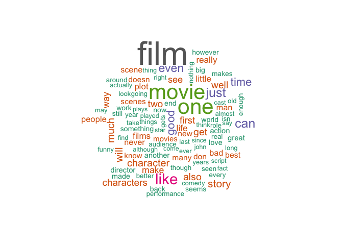
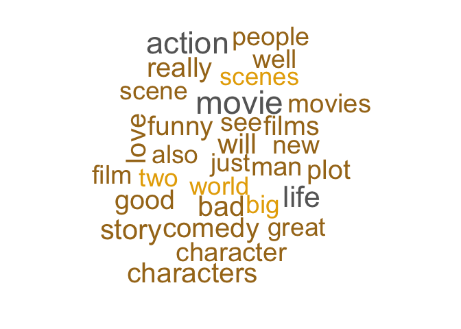

Minería de textos básica
================
Roberto Muñoz
07 September, 2017

-   [Ajustamos el locale del sistema de acuerdo al OS del computador](#ajustamos-el-locale-del-sistema-de-acuerdo-al-os-del-computador)
-   [Instalamos y cargamos las librerías que usaremos](#instalamos-y-cargamos-las-librerias-que-usaremos)
-   [Preparación y análisis de datos](#preparacion-y-analisis-de-datos)
    -   [Lectura de datos](#lectura-de-datos)
    -   [Creación del corpus](#creacion-del-corpus)
    -   [Creación de matriz DTM](#creacion-de-matriz-dtm)
    -   [Creación de nube de palabras](#creacion-de-nube-de-palabras)
    -   [Creación de matriz DTM usando tf–idf](#creacion-de-matriz-dtm-usando-tfidf)

Ajustamos el locale del sistema de acuerdo al OS del computador
===============================================================

``` r
#En caso de usa Mac OS X
Sys.setlocale("LC_ALL", 'en_US.UTF-8')
```

    ## [1] "en_US.UTF-8/en_US.UTF-8/en_US.UTF-8/C/en_US.UTF-8/en_US.UTF-8"

``` r
#En caso de usa Windows
#Sys.setlocale("LC_ALL", 'Spanish_Chile.1252')
```

Instalamos y cargamos las librerías que usaremos
================================================

``` r
install_load_library <- function(x){
  for( i in x ){
    if( ! require( i , character.only = TRUE ) ){
      install.packages( i , dependencies = TRUE )
      require( i , character.only = TRUE )
    }
  }
}

#  Then try/install packages...
install_load_library( c('tm', 'SnowballC', 'wordcloud', 'topicmodels') )
```

    ## Loading required package: tm

    ## Loading required package: NLP

    ## Loading required package: SnowballC

    ## Loading required package: wordcloud

    ## Loading required package: RColorBrewer

    ## Loading required package: topicmodels

Preparación y análisis de datos
===============================

Lectura de datos
----------------

Usaremos una base de datos que contiene 2 mil críticas de películas de cine. Las críticas están escritas en inglés, fueron y fueron publicadas por

``` r
reviews = read.csv("https://github.com/rpmunoz/topicos_ingenieria_2/raw/master/clase_1/data/movie_reviews-pang_lee_2004.csv", stringsAsFactors = F)
#View(reviews)
```

Creación del corpus
-------------------

El dataset review dataset contiene dos campos: valoracion (Pos y Neg) y contenido. Usaremos el campo el campo contenido para definir el Corpus (conjunto de documentos).

``` r
review_corpus = Corpus(VectorSource(reviews$contenido))
```

Normalizamos el texto de los reviews aplicando una serie de pasos en el pre procesamiento, 1. Conversión de contenido a minúsuculas 2. Eliminar números 3. Eliminar puntuación y palabras sin significado como artículos, pronombres, preposiciones (stopwords). 4. Eliminar espacios en blanco

``` r
review_corpus = tm_map(review_corpus, content_transformer(tolower))
review_corpus = tm_map(review_corpus, removeNumbers)
review_corpus = tm_map(review_corpus, removePunctuation)
review_corpus = tm_map(review_corpus, removeWords, c("the", "and", "re", "s", stopwords("english")))
review_corpus =  tm_map(review_corpus, stripWhitespace)
```

``` r
inspect(review_corpus[3])
```

    ## <<SimpleCorpus>>
    ## Metadata:  corpus specific: 1, document level (indexed): 0
    ## Content:  documents: 1
    ## 
    ## [1]  ve got mail works alot better deserves order make film success cast two extremely popular attractive stars share screen two hours collect profits real acting involved original inventive bone body basically complete shoot shop around corner adding modern twists essentially goes defies concepts good contemporary filmmaking overly sentimental times terribly mushy mention manipulative oh enjoyable manipulation must something casting manipulation makes movie work well absolutely hated previous ryanhanks teaming sleepless seattle couldn t directing films helmed woman haven t quite yet figured liked much ve got mail really important like something much even question storyline cliched come tom hanks plays joe fox insanely likeable owner discount book chain meg ryan plays kathleen kelley even insanely likeable proprietor family run children book shop called nice homage shop around corner fox kelley soon become bitter rivals new fox books store opening right across block small business little know already love internet neither party knows person true identity rest story isn t important serve mere backdrop two stars share screen sure mildly interesting subplots fail comparison utter cuteness main relationship course leads predictable climax foreseeable ending damn cute well done doubt movie entire year contains scene evokes much pure joy part ryan discovers true identity online love filled lack better word happiness first time year actually left theater smiling

Creación de matriz DTM
----------------------

Para analizar datos en forma de texto, usamos una representación del tipo Document-Term Matrix (DTM): Documentos como filas, palabras como columnas, frecuencia de las palabras en el documento como valores. Debido al número de palabras únicas en el corpus esta matriz puede ser muy grande.

``` r
review_dtm <- DocumentTermMatrix(review_corpus)
review_dtm
```

    ## <<DocumentTermMatrix (documents: 2000, terms: 38956)>>
    ## Non-/sparse entries: 533481/77378519
    ## Sparsity           : 99%
    ## Maximal term length: 54
    ## Weighting          : term frequency (tf)

Inspeccionamos una pequeña sección de esta matriz

``` r
inspect(review_dtm[500:505, 100:105])
```

    ## <<DocumentTermMatrix (documents: 6, terms: 6)>>
    ## Non-/sparse entries: 16/20
    ## Sparsity           : 56%
    ## Maximal term length: 10
    ## Weighting          : term frequency (tf)
    ## Sample             :
    ##      Terms
    ## Docs  englishman enough era even features film
    ##   500          0      0   0    1        0    3
    ##   501          0      3   0    2        0    2
    ##   502          0      1   0    6        0   27
    ##   503          0      0   0    5        0    9
    ##   504          0      2   0    2        0   16
    ##   505          0      1   0    2        0    1

Para reducir la dimnesionalidad de la matriz DTM, podemos eliminar las palabras menos frecuentes. Para ellos usamos la función removeSparseTerms() y el valor 99 para la dispersión.

``` r
review_dtm = removeSparseTerms(review_dtm, 0.99)
review_dtm
```

    ## <<DocumentTermMatrix (documents: 2000, terms: 4435)>>
    ## Non-/sparse entries: 407845/8462155
    ## Sparsity           : 95%
    ## Maximal term length: 17
    ## Weighting          : term frequency (tf)

Veamos el primer review

``` r
inspect(review_dtm[1,1:20])
```

    ## <<DocumentTermMatrix (documents: 1, terms: 20)>>
    ## Non-/sparse entries: 20/0
    ## Sparsity           : 0%
    ## Maximal term length: 10
    ## Weighting          : term frequency (tf)
    ## Sample             :
    ##     Terms
    ## Docs accent acting acts actually adapted alan albert allen almost amounts
    ##    1      2      1    1        1       1    1      1     1      1       1

Creación de nube de palabras
----------------------------

Construyamos una nube palabras usando la función findFreqTerms() y usemos solamente las palabras que tienen una frecuencia absoluta de al menos 1000.

``` r
findFreqTerms(review_dtm, 1000)
```

    ##  [1] "another"    "back"       "bad"        "big"        "can"       
    ##  [6] "don"        "end"        "even"       "film"       "films"     
    ## [11] "first"      "get"        "good"       "great"      "like"      
    ## [16] "little"     "love"       "made"       "make"       "much"      
    ## [21] "never"      "new"        "one"        "really"     "scenes"    
    ## [26] "see"        "seems"      "time"       "well"       "will"      
    ## [31] "world"      "character"  "doesn"      "know"       "life"      
    ## [36] "many"       "movie"      "plot"       "story"      "two"       
    ## [41] "way"        "scene"      "something"  "work"       "best"      
    ## [46] "director"   "just"       "movies"     "also"       "characters"
    ## [51] "man"        "people"     "action"     "still"

Usemos la función wordcloud() para mostrarlas gráficamente

``` r
freq = data.frame(sort(colSums(as.matrix(review_dtm)), decreasing=TRUE))
wordcloud(rownames(freq), freq[,1], max.words=100, colors=brewer.pal(8, "Dark2"))
```



Un podría argumentar que en la nube de palabras, los términos one, film y movie no son del todo relavantes, pues ya sabemos que el dataset es acerca de películas.

Creación de matriz DTM usando tf–idf
------------------------------------

En este tipo de situaciones es conveniente usar la estadística tf-idf (term frequency-inverse document frequency) en vez de la frecuencia de los términos como valor en la matriz DTM. La métrica tf-idf mide la importancia relativa de las palabras en un documento.

``` r
review_dtm_tfidf <- DocumentTermMatrix(review_corpus, control = list(weighting = weightTfIdf))
review_dtm_tfidf = removeSparseTerms(review_dtm_tfidf, 0.95)
review_dtm_tfidf
```

    ## <<DocumentTermMatrix (documents: 2000, terms: 979)>>
    ## Non-/sparse entries: 259092/1698908
    ## Sparsity           : 87%
    ## Maximal term length: 14
    ## Weighting          : term frequency - inverse document frequency (normalized) (tf-idf)

Veamos el primer review

``` r
inspect(review_dtm[1,1:20])
```

    ## <<DocumentTermMatrix (documents: 1, terms: 20)>>
    ## Non-/sparse entries: 20/0
    ## Sparsity           : 0%
    ## Maximal term length: 10
    ## Weighting          : term frequency (tf)
    ## Sample             :
    ##     Terms
    ## Docs accent acting acts actually adapted alan albert allen almost amounts
    ##    1      2      1    1        1       1    1      1     1      1       1

Generemos una nueva nube de palabras

``` r
freq = data.frame(sort(colSums(as.matrix(review_dtm_tfidf)), decreasing=TRUE))
wordcloud(rownames(freq), freq[,1], max.words=30, scale = c(3, 0.3), colors=brewer.pal(8, "Dark2"))
```


