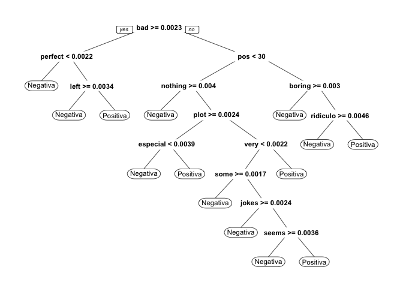

Minería de textos básica
================
Roberto Muñoz
29 September, 2017

-   [Ajustamos el locale del sistema de acuerdo al OS del computador](#ajustamos-el-locale-del-sistema-de-acuerdo-al-os-del-computador)
-   [Instalamos y cargamos las librerías que usaremos](#instalamos-y-cargamos-las-librerias-que-usaremos)
-   [Lectura de datos](#lectura-de-datos)
-   [Construcción de modelo predictivo](#construccion-de-modelo-predictivo)

Ajustamos el locale del sistema de acuerdo al OS del computador
===============================================================

``` r
#En caso de usa Mac OS X
Sys.setlocale("LC_ALL", 'en_US.UTF-8')
```

    ## [1] "en_US.UTF-8/en_US.UTF-8/en_US.UTF-8/C/en_US.UTF-8/en_US.UTF-8"

``` r
#En caso de usa Windows
#Sys.setlocale("LC_ALL", 'Spanish_Chile.1252')
```

Instalamos y cargamos las librerías que usaremos
================================================

``` r
install_load_library <- function(x){
  for( i in x ){
    if( ! require( i , character.only = TRUE ) ){
      install.packages( i , dependencies = TRUE )
      require( i , character.only = TRUE )
    }
  }
}

#  Then try/install packages...
install_load_library( c('tm', 'SnowballC', 'wordcloud', 'topicmodels') )
```

    ## Loading required package: tm

    ## Loading required package: NLP

    ## Loading required package: SnowballC

    ## Loading required package: wordcloud

    ## Loading required package: RColorBrewer

    ## Loading required package: topicmodels

Lectura de datos
================

Usaremos una base de datos que contiene información acerca Next we load the move review dataset

``` r
reviews = read.csv("https://github.com/rpmunoz/topicos_ingenieria_2/raw/master/clase_1/data/movie_reviews-pang_lee_2004.csv", stringsAsFactors = F)
View(reviews)
```

El dataset review dataset contiene dos campos: valoracion (Pos y Neg) y contenido. Transformamos este dataset en un corpus.

``` r
review_corpus = Corpus(VectorSource(reviews$contenido))
class(review_corpus)
```

    ## [1] "SimpleCorpus" "Corpus"

``` r
tdm <- TermDocumentMatrix(review_corpus)
class(tdm)
```

    ## [1] "TermDocumentMatrix"    "simple_triplet_matrix"

Construcción de modelo predictivo
=================================

Para predecir la polaridad (sentimiento) de una crítica de película, podemos usar un a lista precompilada de palabras con significado positivo y negativo.

``` r
neg_words = read.table("data/negative-words.txt", header = F, stringsAsFactors = F)[, 1]
pos_words = read.table("data/positive-words.txt", header = F, stringsAsFactors = F)[, 1]
```

Como un simple indicar, creamos dos campos (neg y pos) que contendrán el número de palabras positivas y negativas que aparecen en cada crítica

``` r
reviews$neg = tm_term_score(tdm, neg_words)
  #sapply(review_corpus, tm_term_score, neg_words)
reviews$pos = tm_term_score(tdm, pos_words)
  #sapply(review_corpus, tm_term_score, pos_words)
```

Visualizamos la variable reviews

``` r
View(reviews)
```

Borramos el campo contenido pues construiremos un modelo estadísitico usando solo campos simples

``` r
reviews$contenido = NULL
```

En este tipo de situaciones es conveniente usar la estadística tf-idf (term frequency-inverse document frequency) en vez de la frecuencia de los términos como valor en la matriz DTM. La métrica tf-idf mide la importancia relativa de las palabras en un documento.

``` r
review_dtm_tfidf <- DocumentTermMatrix(review_corpus, control = list(weighting = weightTfIdf))
review_dtm_tfidf = removeSparseTerms(review_dtm_tfidf, 0.95)
review_dtm_tfidf
```

    ## <<DocumentTermMatrix (documents: 2000, terms: 1074)>>
    ## Non-/sparse entries: 349726/1798274
    ## Sparsity           : 84%
    ## Maximal term length: 14
    ## Weighting          : term frequency - inverse document frequency (normalized) (tf-idf)

Combinamos la matriz tf-idf con el análisis de sentimiento de acuerdo a la lista de valoracion

``` r
reviews = cbind(reviews, as.matrix(review_dtm_tfidf))
reviews$valoracion = as.factor(reviews$valoracion)
```

Dividimos los datos en un dataset de entrenamiento y otro para testing

``` r
id_train <- sample(nrow(reviews), nrow(reviews)*0.8)
reviews.train = reviews[id_train,]
reviews.test = reviews[-id_train,]
```

``` r
cat("Numero de registros en train: ", nrow(reviews.train), "\n")
```

    ## Numero de registros en train:  1600

``` r
cat("Numero de registros en test: ", nrow(reviews.test), "\n")
```

    ## Numero de registros en test:  400

Instalamos y cargamos las librerías de logistic regression, decision tree, SVM, y neural network models.

``` r
install_load_library( c('rpart', 'rpart.plot', 'e1071', 'nnet') )
```

    ## Loading required package: rpart

    ## Loading required package: rpart.plot

    ## Loading required package: e1071

    ## Loading required package: nnet

Entrenemos los modelos

``` r
reviews.tree = rpart(valoracion~.,  method = "class", data = reviews.train);
prp(reviews.tree)
```



``` r
reviews.glm = glm(valoracion~ ., family = "binomial", data =reviews.train, maxit = 100);  
```

    ## Warning: glm.fit: fitted probabilities numerically 0 or 1 occurred

``` r
reviews.svm = svm(valoracion~., data = reviews.train);
reviews.nnet = nnet(valoracion~., data=reviews.train, size=1, maxit=500, MaxNWts=1100)
```

    ## # weights:  1079
    ## initial  value 1212.550398 
    ## iter  10 value 1035.096355
    ## iter  20 value 955.442276
    ## iter  30 value 936.941721
    ## iter  40 value 912.309308
    ## iter  50 value 614.455149
    ## iter  60 value 175.893770
    ## iter  70 value 6.408738
    ## iter  80 value 0.047624
    ## iter  90 value 0.000203
    ## iter  90 value 0.000095
    ## iter  90 value 0.000041
    ## final  value 0.000041 
    ## converged

Evaluemos el performance usando el dataset de entrenamiento. Partimos con los arboles de decisión

``` r
pred.tree = predict(reviews.tree, reviews.test,  type="class")
table(reviews.test$valora,pred.tree,dnn=c("Obs","Pred"))
```

    ##           Pred
    ## Obs        Negativa Positiva
    ##   Negativa      144       64
    ##   Positiva       68      124

``` r
mean(ifelse(reviews.test$valoracion != pred.tree, 1, 0))
```

    ## [1] 0.33

Seguimos con regresión logística

``` r
pred.glm = as.numeric(predict(reviews.glm, reviews.test, type="response") > 0.5)
pred.glm = ifelse(pred.glm==1,"Positiva","Negativa")
table(reviews.test$valoracion,pred.glm,dnn=c("Obs","Pred"))
```

    ##           Pred
    ## Obs        Negativa Positiva
    ##   Negativa      138       70
    ##   Positiva       62      130

``` r
mean(ifelse(reviews.test$valoracion != pred.glm, 1, 0))
```

    ## [1] 0.33

Seguimos con modelo SVM

``` r
pred.svm = predict(reviews.svm, reviews.test)
table(reviews.test$valoracion,pred.svm,dnn=c("Obs","Pred"))
```

    ##           Pred
    ## Obs        Negativa Positiva
    ##   Negativa      179       29
    ##   Positiva       35      157

``` r
mean(ifelse(reviews.test$valoracion != pred.svm, 1, 0))
```

    ## [1] 0.16

Seguimos con la red neuronal

``` r
prob.nnet= predict(reviews.nnet,reviews.test)
pred.nnet = as.numeric(prob.nnet > 0.5)
pred.nnet = ifelse(pred.nnet==1,"Positiva","Negativa")
table(reviews.test$valoracion, pred.nnet, dnn=c("Obs","Pred"))
```

    ##           Pred
    ## Obs        Negativa Positiva
    ##   Negativa      164       44
    ##   Positiva       30      162

``` r
mean(ifelse(reviews.test$valoracion != pred.nnet, 1, 0))
```

    ## [1] 0.185
